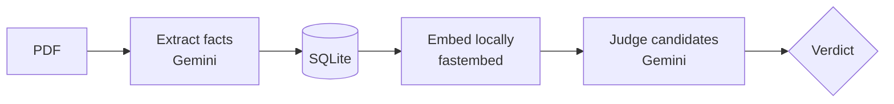

<div align="center">

# FactMesh

**A fact knowledge layer for PDFs**

Extract facts. Ground every one in evidence. Reconcile them across documents — automatically.

[](https://python.org)
[](https://fastapi.tiangolo.com)
[](https://react.dev)
[](https://ai.google.dev)

</div>

<br/>

Upload a PDF and FactMesh pulls out every checkable fact, pinned to the exact page and sentence it came from. Upload a second, overlapping PDF, and it automatically works out which facts agree, which genuinely disagree, and which only *look* like they disagree until you account for time, scope, or definition.

Built for the Superjoin VIT 2026 Engineering Intern hiring assignment.

<br/>

## Demo Video

📺 **[Watch the demo](https://drive.google.com/file/d/1N_b52YM1vN_2uvIbj92D907X0tXCxjfe/view?usp=sharing)**

<br/>

## Setup

Requires Python 3.11+. A Gemini API key is only needed to upload *new* PDFs — see the tip below.

```bash
cd factmesh/backend
python -m venv .venv
.venv\Scripts\activate          # Windows; use `source .venv/bin/activate` on macOS/Linux
pip install -r requirements.txt
cp .env.example .env            # paste a free key from https://aistudio.google.com/apikey into .env
```

```bash
uvicorn app.main:app --host 127.0.0.1 --port 8000
```

Open **http://127.0.0.1:8000**, drop in a PDF, and watch it move through `extracting → embedding → linking → done`.

> **You don't need a key just to look around.** The repo ships pre-loaded with 2,066 facts and 155 relationships from all 6 starter documents — copied into place the first time you run the server. A key is only spent when you upload something new. Want a blank slate? Delete `backend/data/` first.

<br/>

## How it works

Every fact has the same shape — `entity, attribute, value, unit, scope, as_of`, plus a quote and page number — so nothing about the schema changes no matter what kind of document comes in next.



| Verdict | Meaning |
|---|---|
| ✅ **Corroborates** | Both documents agree — even if worded differently |
| ⚡ **Contradicts** | Both documents genuinely disagree, no explanation in sight |
| 🔄 **Contextual** | Looks contradictory, but time, scope, or definition explains it |

A new document's facts are compared only against facts *already in the database* — never against relationships computed for older documents — so adding document #10 costs work proportional to document #10, not the whole knowledge base.

**A few design calls, briefly:**

- **No graph database.** The hard part is judgment (is this a real contradiction, or does "provisional vs. revised" explain it?), and that lives entirely in the LLM step. A `facts` table + a `relationships` table with two foreign keys already *is* a graph where it matters.
- **Embeddings run locally**, not through Gemini — its free embedding quota is 100 requests/day, and every fact needs one. A small local model (`fastembed`) does the cheap similarity prefiltering for free; Gemini is reserved for extraction and judgment, where real reasoning is needed.
- **Frontend is React with zero build step.** Loaded from a CDN, JSX transformed in the browser — no `npm install`, no bundler. Cloning the repo and running `uvicorn` is the entire setup.

<br/>

## Example Findings

Real results from all six starter documents in one shared knowledge base — not constructed examples.

**✅ Corroborated, worded differently.** Delhivery's annual report gives pin-code reach as *"18,793"*; its Q4 earnings deck separately says *"pin-code reach: 18,793."* Same number, correctly matched.

**⚡ A genuine contradiction.** Delhivery's own annual report cites the IMF: global growth *"will likely hold steady at 3.3%"* for 2025. RBI's annual report separately says *"2.8 per cent in 2025."* Same figure, same year, no reconciling detail in either quote — flagged as a contradiction.

**🔄 Explained by context.** The IMF says India's policy rate was *"5.5 percent"* in June 2025. RBI's own report shows *"6.50 per cent"* (2023–Jan 2025), then *"6.25 per cent"* (Feb 2025), then *"6.0 per cent"* (April 2025). Read together, it's just RBI's own rate-cut cycle — correctly reconciled, naming the date difference.

**🧯 A real reasoning failure.** One `corroborates` match pairs an absolute EBITDA figure (*"₹1,266 Mn"*) with an EBITDA *margin* (*"1.6%"*) — different kinds of metric entirely. The model's own explanation gives it away, misquoting fact A's value. The UI always shows both raw quotes side by side, so a wrong label doesn't hide the evidence needed to catch it.

<br/>

## Limitations

- No OCR fallback — a scanned PDF with no text layer yields nothing.
- Candidate matching is similarity-based, so an unusually-worded match can be missed.
- No unit or metric-type conversion — the LLM reasons about this itself, usually correctly (see the EBITDA case above for where it wasn't).
- Ingestion runs as a single background task; a server restart mid-upload loses that job's progress.

<br/>

**AI tools used:** Gemini (`gemini-flash-lite-latest`) for extraction and relationship judgment. `BAAI/bge-small-en-v1.5` for local embeddings. Built with Claude Code.

<div align="center">

<br/>

Made for the Superjoin VIT 2026 Engineering Intern assignment.

</div>
